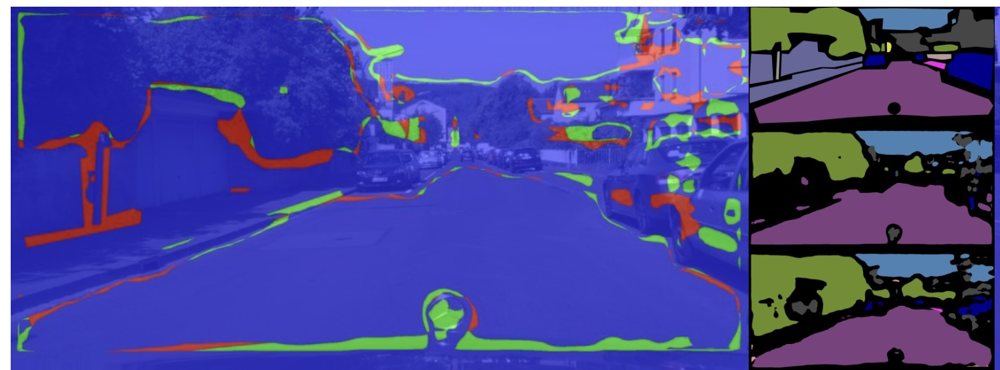
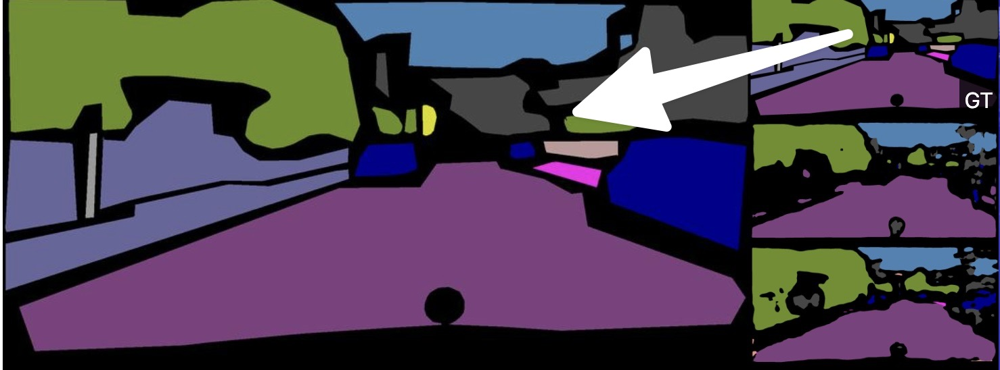

## Jun 22, 2024

*Model Improvement View*

Today, we added the ability to mouse over the label thumbnails in Model Improvement View and have them enlarge, so you can quickly see how each label looks.

For example, when looking at model improvement like this:

if you now mouse over the thumbnail in top-right, you will see that label enlarged:

